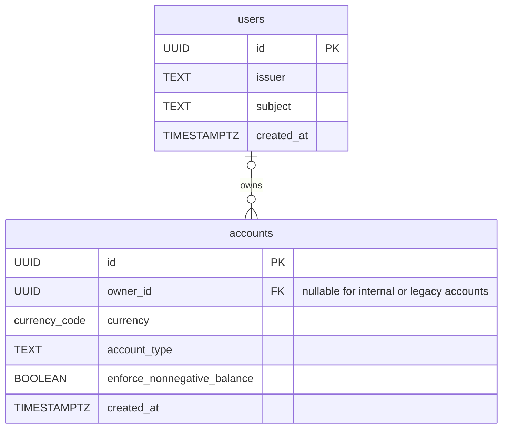
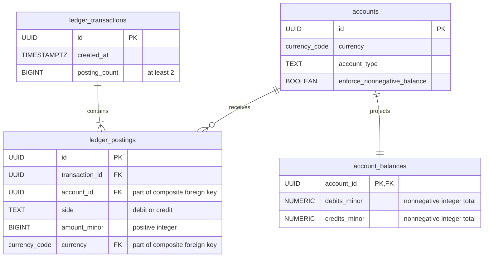

# Database Schema

[Documentation index](README.md) · [Project overview](../README.md)

These diagrams describe the PostgreSQL schema after migrations 00001–00004.
`PK` marks primary keys and `FK` marks foreign keys. Composite unique keys
are described below the diagrams.

## Users and Account Ownership

A user can own zero or more accounts; an account has zero or one owner.
The pair `(issuer, subject)` uniquely identifies a local user. Owned accounts
must be liabilities with nonnegative-balance enforcement. Assigned ownership
and user identity are immutable.

## Ledger and Balance Projections

The `accounts` entity below is the same table shown above, with only the
columns relevant to the ledger relationships displayed.

Each committed ledger transaction contains at least two postings, with equal
debit and credit totals per currency. Mermaid's one-or-more notation represents
this relationship; deferred database checks enforce the minimum and the exact
`posting_count`. Transactions and postings are append-only.

The unique account key `(id, currency)` is referenced by the composite posting
foreign key `(account_id, currency)`, so a posting always uses its account's
currency (`EUR`, `USD`, or `GBP`). Each account receives one balance projection
through an insert trigger and migration backfill. Posting inserts update these
totals atomically. Posted balance is calculated from the totals and account type;
it is not a stored column.

## Related Documentation

- [Architecture](architecture.md) — module boundaries
- [Authentication](authentication.md) — ownership policy and migration behavior
- [Money, ledger, and balances](ledger.md) — constraints, projections, and reconciliation
